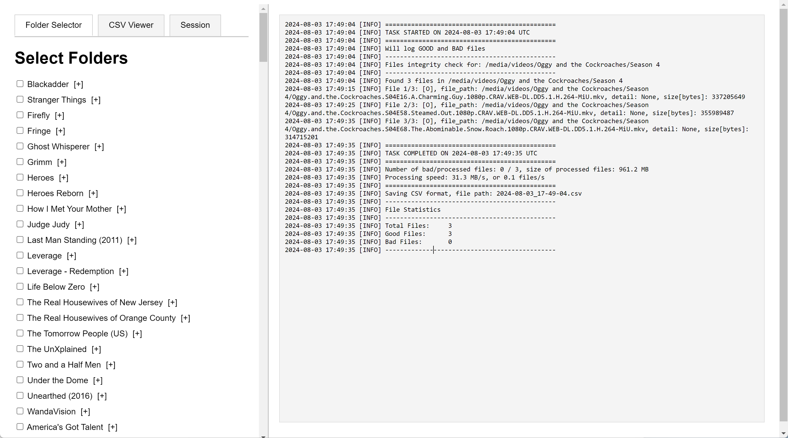
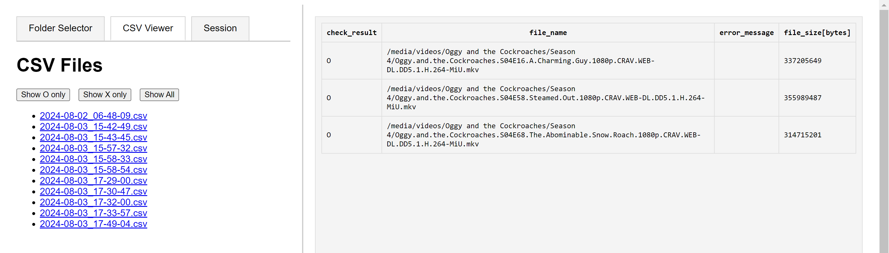

# check-media-integrity

This is MODIFIED version of the original repo by `ftarlao/check-media-integrity`, focusing to capture ALL possible error when checking video file.

Also featured in my website: https://dsync89.com

## Mods
- Check for video metadata using `mediainfo` before checking using `ffmpeg`. Metadata check is faster, if it failed, then do `ffmpeg`.
- More reliable video checking using `ffmpeg -v error` instead of the default `strict` profile way. The error is decided by searching for the `error` word in the stderr (redirected to stdout). Using exit code or strict profile DOES NOT CAPTURE all the error case. 
- Write GOOD and BAD files to CSV by default, provide `-b` arg to show bad files only
- Use `logging` framework to print statements
- Print file statistics after run
- Code refactor, each checker is now in its own class
- Web UI
- Many more formatting enhancement

### CSV Output
- Use tab delimiter `\t` instead of `,` because some error might contains `,`, such as the error outputted by `ffmpeg`.
- CSV file is always written if folder is provided
- Added a `check_status` to the first column. `O` means file OK, `X` means bad file.
- Error message is formatted using `JSON` for JSON prettify of the error message is too long, e.g. when error is checked in FFMPEG.

### Web UI
- Running on port `5566`
- Support Folder Selector, CSV Viewer, and Session tabs (TODO)





Web UI is started by default when you run the container using `python3 app.py`.

## Running as Container

I've built a container image to run this and uploaded to DockerHub with the image name `dsync89/check-media-integrity:latest`. It is meant to run interactively, e.g. you have to login via console to that container and run the check command manually.

```
docker run -it -p 5566:5566 dsync89/check-media-integrity:latest /bin/bash

# check the test file
python3 check_mi.py -m -r test_folder/files

# check your media
python3 check_mi.py -m -r /media/videos/Survivor/Season\ 28
```

### Docker Compose

I run this as `docker-compose` stack on my unRAID server. To run it, create a `docker-compose.yml` file below.

```
services:
  check-media-integrity:
    image: dsync89/check-media-integrity:latest
    volumes:
      - <path/to/your/media/to/check>:/media/videos:ro # <-- replace the path 
      - /mnt/user/appdata/check-media-integrity/logs:/app/logs
   # command: ["./check_mi.py"]  # Override the default CMD if needed
    ports:
      - 5566:5566
```

## Output Example when running against the files in `test_folder`:

```
python3 check_mi.py -m -r test_folder/files
```

```
2024-07-29 18:19:44 [INFO] ==============================================
2024-07-29 18:19:44 [INFO] TASK STARTED ON 2024-07-29 18:19:44 UTC
2024-07-29 18:19:44 [INFO] ==============================================
2024-07-29 18:19:44 [INFO] Will log GOOD and BAD files
2024-07-29 18:19:44 [INFO] ----------------------------------------------
2024-07-29 18:19:44 [INFO] Files integrity check for: test_folder/files
2024-07-29 18:19:44 [INFO] ----------------------------------------------
2024-07-29 18:19:44 [INFO] Found 6 files in test_folder/files
2024-07-29 18:19:44 [INFO] File 1/6: [X], file_path: test_folder/files/050807-124755t.jpg, detail: image file is truncated (0 bytes not processed), size[bytes]: 39000
2024-07-29 18:19:44 [INFO] File 2/6: [O], file_path: test_folder/files/Albert_Memorial,_London_-_May_2008.jpg, detail: None, size[bytes]: 7111260
2024-07-29 18:19:44 [INFO] File 3/6: [O], file_path: test_folder/files/fake_movie.mp4, detail: None, size[bytes]: 119
2024-07-29 18:19:44 [INFO] File 4/6: [O], file_path: test_folder/files/deep/050807-124755.jpg, detail: None, size[bytes]: 41600
2024-07-29 18:19:44 [INFO] File 5/6: [X], file_path: test_folder/files/deep/050807-124755b.jpg, detail: broken data stream when reading image file, size[bytes]: 41576
2024-07-29 18:19:45 [INFO] File 6/6: [O], file_path: test_folder/files/deep/Bees3Wmv.mp4, detail: None, size[bytes]: 2903741
2024-07-29 18:19:45 [INFO] ==============================================
2024-07-29 18:19:45 [INFO] TASK COMPLETED ON 2024-07-29 18:19:45 UTC
2024-07-29 18:19:45 [INFO] ==============================================
2024-07-29 18:19:45 [INFO] Number of bad/processed files: 2 / 6, size of processed files: 9.7 MB
2024-07-29 18:19:45 [INFO] Processing speed: 23.1 MB/s, or 14.3 files/s
2024-07-29 18:19:45 [INFO] ==============================================
2024-07-29 18:19:45 [INFO] Saving CSV format, file path: 2024-07-29_18-19-44.csv
2024-07-29 18:19:45 [INFO] ----------------------------------------------
2024-07-29 18:19:45 [INFO] File Statistics
2024-07-29 18:19:45 [INFO] ----------------------------------------------
2024-07-29 18:19:45 [INFO] Total Files:     6
2024-07-29 18:19:45 [INFO] Good Files:      4
2024-07-29 18:19:45 [INFO] Bad Files:       2
2024-07-29 18:19:45 [INFO] ----------------------------------------------
```

CSV output
```
check_result	file_name	error_message	file_size[bytes]
X	test_folder/files/050807-124755t.jpg	image file is truncated (0 bytes not processed)	39000
O	test_folder/files/Albert_Memorial,_London_-_May_2008.jpg		7111260
O	test_folder/files/fake_movie.mp4		119
O	test_folder/files/deep/050807-124755.jpg		41600
X	test_folder/files/deep/050807-124755b.jpg	broken data stream when reading image file	41576
O	test_folder/files/deep/Bees3Wmv.mp4		2903741
```

## Output example when scanning corrupted video files that is otherwise not captured by the default method.

```
$ python3 check_mi.py -m -r /media/videos/Survivor/Season\ 28/test/ 
2024-07-29 18:36:49 [INFO] ==============================================
2024-07-29 18:36:49 [INFO] TASK STARTED ON 2024-07-29 18:36:49 UTC
2024-07-29 18:36:49 [INFO] ==============================================
2024-07-29 18:36:49 [INFO] Will log GOOD and BAD files
2024-07-29 18:36:49 [INFO] ----------------------------------------------
2024-07-29 18:36:49 [INFO] Files integrity check for: /media/videos/Survivor/Season 28/test/
2024-07-29 18:36:49 [INFO] ----------------------------------------------
2024-07-29 18:36:49 [INFO] Found 1 files in /media/videos/Survivor/Season 28/test/
2024-07-29 18:36:59 [INFO] File 1/1: [X], file_path: /media/videos/Survivor/Season 28/test/Survivor.S28E05.We.Found.Our.Zombies.1080p.AMZN.WEB-DL.AAC2.0.H.264-AJP69.mkv, detail: {"0":"[matroska,webm @ 0x5563413d9e40] 0x00 at pos 158135 (0x269b7) invalid as first byte of an EBML number","1":"[h264 @ 0x5563415b13c0] error while decoding MB 112 56, bytestream -7","2":"[h264 @ 0x5563415ce040] co located POCs unavailable","3":"[h264 @ 0x5563415eacc0] co located POCs unavailable","4":"[matroska,webm @ 0x5563413d9e40] 0x00 at pos 800196606 (0x2fb207fe) invalid as first byte of an EBML number","5":"[h264 @ 0x55634140f080] error while decoding MB 12 66, bytestream -8","6":"[h264 @ 0x55634140abc0] co located POCs unavailable","7":"[h264 @ 0x5563414abc80] mmco: unref short failure","8":"[h264 @ 0x55634146c780] co located POCs unavailable","9":"[aac @ 0x5563413e26c0] decode_band_types: Input buffer exhausted before END element found","10":"Error while decoding stream #0:1: Invalid data found when processing input","11":"[aac @ 0x5563413e26c0] channel element 0.0 is not allocated","12":"Error while decoding stream #0:1: Invalid data found when processing input","13":"[aac @ 0x5563413e26c0] channel element 0.0 is not allocated","14":"Error while decoding stream #0:1: Invalid data found when processing input","15":"[aac @ 0x5563413e26c0] channel element 0.0 is not allocated","16":"Error while decoding stream #0:1: Invalid data found when processing input","17":"[matroska,webm @ 0x5563413d9e40] 0x00 at pos 1600226258 (0x5f6183d2) invalid as first byte of an EBML number"}, size[bytes]: 2400354304
2024-07-29 18:36:59 [INFO] ==============================================
2024-07-29 18:36:59 [INFO] TASK COMPLETED ON 2024-07-29 18:36:59 UTC
2024-07-29 18:36:59 [INFO] ==============================================
2024-07-29 18:36:59 [INFO] Number of bad/processed files: 1 / 1, size of processed files: 2289.2 MB
2024-07-29 18:36:59 [INFO] Processing speed: 220.9 MB/s, or 0.1 files/s
2024-07-29 18:36:59 [INFO] ==============================================
2024-07-29 18:36:59 [INFO] Saving CSV format, file path: 2024-07-29_18-36-49.csv
2024-07-29 18:36:59 [INFO] ----------------------------------------------
2024-07-29 18:36:59 [INFO] File Statistics
2024-07-29 18:36:59 [INFO] ----------------------------------------------
2024-07-29 18:36:59 [INFO] Total Files:     1
2024-07-29 18:36:59 [INFO] Good Files:      0
2024-07-29 18:36:59 [INFO] Bad Files:       1
2024-07-29 18:36:59 [INFO] ----------------------------------------------
```

CSV Output
```
check_result	file_name	error_message	file_size[bytes]
X	/media/videos/Survivor/Season 28/test/Survivor.S28E05.We.Found.Our.Zombies.1080p.AMZN.WEB-DL.AAC2.0.H.264-AJP69.mkv	{"0":"[matroska,webm @ 0x5563413d9e40] 0x00 at pos 158135 (0x269b7) invalid as first byte of an EBML number","1":"[h264 @ 0x5563415b13c0] error while decoding MB 112 56, bytestream -7","2":"[h264 @ 0x5563415ce040] co located POCs unavailable","3":"[h264 @ 0x5563415eacc0] co located POCs unavailable","4":"[matroska,webm @ 0x5563413d9e40] 0x00 at pos 800196606 (0x2fb207fe) invalid as first byte of an EBML number","5":"[h264 @ 0x55634140f080] error while decoding MB 12 66, bytestream -8","6":"[h264 @ 0x55634140abc0] co located POCs unavailable","7":"[h264 @ 0x5563414abc80] mmco: unref short failure","8":"[h264 @ 0x55634146c780] co located POCs unavailable","9":"[aac @ 0x5563413e26c0] decode_band_types: Input buffer exhausted before END element found","10":"Error while decoding stream #0:1: Invalid data found when processing input","11":"[aac @ 0x5563413e26c0] channel element 0.0 is not allocated","12":"Error while decoding stream #0:1: Invalid data found when processing input","13":"[aac @ 0x5563413e26c0] channel element 0.0 is not allocated","14":"Error while decoding stream #0:1: Invalid data found when processing input","15":"[aac @ 0x5563413e26c0] channel element 0.0 is not allocated","16":"Error while decoding stream #0:1: Invalid data found when processing input","17":"[matroska,webm @ 0x5563413d9e40] 0x00 at pos 1600226258 (0x5f6183d2) invalid as first byte of an EBML number"}	2400354304
```

You can copy and paste the third column to JSON validator site like JSONLint and it will format it nicely, e.g.
```
{
    "0": "[matroska,webm @ 0x5563413d9e40] 0x00 at pos 158135 (0x269b7) invalid as first byte of an EBML number",
    "1": "[h264 @ 0x5563415b13c0] error while decoding MB 112 56, bytestream -7",
    "2": "[h264 @ 0x5563415ce040] co located POCs unavailable",
    "3": "[h264 @ 0x5563415eacc0] co located POCs unavailable",
    "4": "[matroska,webm @ 0x5563413d9e40] 0x00 at pos 800196606 (0x2fb207fe) invalid as first byte of an EBML number",
    "5": "[h264 @ 0x55634140f080] error while decoding MB 12 66, bytestream -8",
    "6": "[h264 @ 0x55634140abc0] co located POCs unavailable",
    "7": "[h264 @ 0x5563414abc80] mmco: unref short failure",
    "8": "[h264 @ 0x55634146c780] co located POCs unavailable",
    "9": "[aac @ 0x5563413e26c0] decode_band_types: Input buffer exhausted before END element found",
    "10": "Error while decoding stream #0:1: Invalid data found when processing input",
    "11": "[aac @ 0x5563413e26c0] channel element 0.0 is not allocated",
    "12": "Error while decoding stream #0:1: Invalid data found when processing input",
    "13": "[aac @ 0x5563413e26c0] channel element 0.0 is not allocated",
    "14": "Error while decoding stream #0:1: Invalid data found when processing input",
    "15": "[aac @ 0x5563413e26c0] channel element 0.0 is not allocated",
    "16": "Error while decoding stream #0:1: Invalid data found when processing input",
    "17": "[matroska,webm @ 0x5563413d9e40] 0x00 at pos 1600226258 (0x5f6183d2) invalid as first byte of an EBML number"
}
```

## Output example to show bad files only

```
$ python3 check_mi.py -m -r test_folder/files -b
2024-07-29 19:02:02 [INFO] ==============================================
2024-07-29 19:02:02 [INFO] TASK STARTED ON 2024-07-29 19:02:02 UTC
2024-07-29 19:02:02 [INFO] ==============================================
2024-07-29 19:02:02 [INFO] Will only log BAD files only due to -b argument
2024-07-29 19:02:02 [INFO] ----------------------------------------------
2024-07-29 19:02:02 [INFO] Files integrity check for: test_folder/files
2024-07-29 19:02:02 [INFO] ----------------------------------------------
2024-07-29 19:02:02 [INFO] Found 6 files in test_folder/files
2024-07-29 19:02:02 [INFO] File 1/6: [X], file_path: test_folder/files/050807-124755t.jpg, detail: image file is truncated (0 bytes not processed), size[bytes]: 39000
2024-07-29 19:02:03 [INFO] File 5/6: [X], file_path: test_folder/files/deep/050807-124755b.jpg, detail: broken data stream when reading image file, size[bytes]: 41576
2024-07-29 19:02:03 [INFO] ==============================================
2024-07-29 19:02:03 [INFO] TASK COMPLETED ON 2024-07-29 19:02:03 UTC
2024-07-29 19:02:03 [INFO] ==============================================
2024-07-29 19:02:03 [INFO] Number of bad/processed files: 2 / 6, size of processed files: 9.7 MB
2024-07-29 19:02:03 [INFO] Processing speed: 12.8 MB/s, or 8.0 files/s
2024-07-29 19:02:03 [INFO] ==============================================
2024-07-29 19:02:03 [INFO] Saving CSV format, file path: 2024-07-29_19-02-02.csv
2024-07-29 19:02:03 [INFO] ----------------------------------------------
2024-07-29 19:02:03 [INFO] File Statistics
2024-07-29 19:02:03 [INFO] ----------------------------------------------
2024-07-29 19:02:03 [INFO] Total Files:     6
2024-07-29 19:02:03 [INFO] Good Files:      4
2024-07-29 19:02:03 [INFO] Bad Files:       2
2024-07-29 19:02:03 [INFO] ----------------------------------------------
```

CSV output

```
check_result	file_name	error_message	file_size[bytes]
X	test_folder/files/050807-124755t.jpg	image file is truncated (0 bytes not processed)	39000
X	test_folder/files/deep/050807-124755b.jpg	broken data stream when reading image file	41576
```

## Motivation

I first wrote a simple shell script to check for error in my bittorrent downloaded TV series in which some of the episodes files were corrupted. But I wanted a more flexible way to check it and possibly an existing framework, then found the original repo and modified it.

Simple bash script I originally wrote in KISS fashion:

```bash
#!/bin/bash

# Check if VIDEO_FOLDER is provided as an argument
if [ -z "$1" ]; then
  echo "Usage: $0 <video_folder>"
  exit 1
fi

VIDEO_FOLDER="$1"

BASENAME=$(date "+%Y-%m-%d_%H-%M-%S")
echo "$BASENAME"

FILENAME_OK="${BASENAME}-OK.log"
FILENAME_KO="${BASENAME}-KO.log"

echo "-------------------------" > "${FILENAME_KO}"
echo "KO Videos" >> "${FILENAME_KO}"
echo "-------------------------" >> "${FILENAME_KO}"

echo "-------------------------" > "${FILENAME_OK}"
echo "OK Videos" >> "${FILENAME_OK}"
echo "-------------------------" >> "${FILENAME_OK}"

# Function to check if a file is a valid media file
check_media_file() {
    local file="$1"
    echo -n "$file..."
    # ffmpeg -v error -i "$file" -f null - 2>&1 | grep -q "error"
    ffmpeg -v error -i "$file" -f null -
    if [ $? -ne 0 ]; then
        echo "$file" >> "OK.log"
        echo "OK"
    else
        echo "$file" >> "KO.log"
        echo "KO"
    fi
}

export -f check_media_file

# Find all media files and check them in parallel using xargs
find "$VIDEO_FOLDER" -type f \( -iname "*.mp4" -o -iname "*.mkv" -o -iname "*.avi" \) -print0 | xargs -0 -n 1 -P 1 -I {} bash -c 'check_media_file "{}"'
```


## TODO

If I have time:
- UI that logs each session run, like Speed-Tracker

## FOLLOWING ARE FROM THE ORIGINAL REPO

- Converted from Python2.7 to Python 3 (3.8) .. comes with bugfixes :-)

## Overview
*check-mi* is a Python 3 script (tested with Python 3.8) that automatically checks the integrity of media files (pictures, video, audio).
You can check the integrity of a single file, or set of files in a folder and subfolders recursively, finally you can optionally output the list of bad files with their path and details in CSV format. 

The tool tests file integrity using common libraries (Pillow, ImageMagik, FFmpeg) and checking when they are effectively able to decode the media files.
Warning, **image, audio and video formats are very resilient to defects and damages** for this reason the tool cannot detect all the damaged files.

*check-mi* is able, with 100% confidence, to spot files that have broken header/metadata, truncated image files (with *strict_level* >0), and device i/o errors.

*check-mi* is, usually, not able to detect all the minor damages--e.g. small portion of media file overwritten with different values.
In detail, I have tested *strict_level* 1 with a small randomized experiment, executed on a single 5MB *jpeg* picture:
- Overwriting a portion (interval) of image file with **zeros**, you need interval **size = 1024KBytes** in order to get **50%** chance of detecting the damage.
- Overwriting a portion (interval) of image file with **different random values**, you obtain about **85%** detection ratio, for interval sizes ranging **from 4096bytes to 1024Kbytes**.

In the case you know ways to instruct Pillow, Wand and FFmpeg to be stricter when decoding, please tell me.

*check-mi* help:
```
usage: check_mi.py [-h] [-c X] [-v] [-r] [-z Z] [-i] [-m] [-p] [-e] [-x E]
                   [-l L] [-t T] [-T K]
                   P

Checks integrity of Media files (Images, Video, Audio).

positional arguments:
  P                     path to the file or folder

optional arguments:
  -h, --help            show this help message and exit
  -c X, --csv X         Save bad files details on csv file X
  -v, --version         show program's version number and exit
  -r, --recurse         Recurse subdirs
  -z Z, --enable_zero_detect Z
                        Detects when files contains a byte sequence of at
                        least Z equal bytes. This case is quite common, for
                        jpeg format too, you need to set high Z values
  -i, --disable-images  Ignore image files
  -m, --enable-media    Enable check for audio/video files
  -p, --disable-pdf     Ignore pdf files
  -e, --disable-extra   Ignore extra image extensions (psd, xcf,. and rare
                        ones)
  -x E, --err-detect E  Execute ffmpeg decoding with a specific err_detect
                        flag E, 'strict' is shortcut for
                        +crccheck+bitstream+buffer+explode
  -l L, --strict_level L
                        Uses different approach for checking images depending
                        on L integer value. Accepted values 0,1 (default),2: 0
                        ImageMagick identify, 1 Pillow library+ImageMagick, 2
                        applies both 0+1 checks
  -t T, --threads T     number of parallel threads used for speedup, default
                        is one. Single file execution does not take advantage
                        of the thread option
  -T K, --timeout K     Number of seconds to wait for new performed checks in
                        queue, default is 120 sec, you need to raise the
                        default when working with video files (usually) bigger
                        than few GBytes

- Single file check ignores options -i,-m,-p,-e,-c,-t

- strict_level: level 0 execution may be faster than level 1 and level 2 is
the slowest one. 0 have low recall and high precision, 1 has higher recall, 2
has the highest recall but could have more false positives

- With 'err_detect' option you can provide the strict shortcut or the flags
supported by ffmpeg, e.g.: crccheck, bitstream, buffer, explode, or their
combination, e.g., +buffer+bitstream

- Supported image formats/extensions: ['jpg', 'jpeg', 'jpe', 'png', 'bmp',
'gif', 'pcd', 'tif', 'tiff', 'j2k', 'j2p', 'j2x', 'webp']

- Supported image EXTRA formats/extensions:['eps', 'ico', 'im', 'pcx', 'ppm',
'sgi', 'spider', 'xbm', 'tga', 'psd', 'xcf']

- Supported audio/video extensions: ['avi', 'mp4', 'mov', 'mpeg', 'mpg',
'm2p', 'mkv', '3gp', 'ogg', 'flv', 'f4v', 'f4p', 'f4a', 'f4b', 'mp3', 'mp2']

- Output CSV file, has the header raw, and one line for each bad file,
providing: file name, error message, file size
```
## Examples

Check a single file (remind, strict_level default is 1 and number of threads default is 1):

```check_mi.py ./test_folder/files/050807-124755t.jpg```

Check a folder (folder ```files```, contains the media files):

```check_mi.py ./test_folder/files```

Check a folder, and subfolder recursively:

```check_mi.py -r ./test_folder/files```

Check a folder, and subfolder recursively and also check media (audio and video):

```check_mi.py -m -r ./test_folder/files```

Check a folder, and subfolder recursively and save bad files details to out.csv file:

```check_mi.py -r ./test_folder/files -c ./test_folder/output/out.csv```

Check a folder, and subfolder recursively using 4 processes/threads, and save bad files details to out.csv file:

```check_mi.py -r -t 4 ./test_folder/files -c ./test_folder/output/out.csv```
## Required Modules

This is what I'm using in my dev env, but different versions may work...

```ffmpeg-python==0.1.17
future==0.17.1
Pillow-SIMD==7.0.0.post3
PyPDF2==1.26.0
Wand==0.4.5
```
You can also use the standard Pillow-PIL module, but it is far slower than Pillow-SIMD.
Now the implementation wotks with PIL-SIMD all versions ( > < = to 6.2.2 )

In case you have only *libav* and not *ffmpeg* library/binaries in your Linux OS, you can fix this by creating a symbolic link *ffmpeg -> full/path/to/avconv* somewhere in your system search path.

## Test damage
test_damage.py is a funny experiment, it evaluates the probability of a random damage to be detected by this tool.
That is the outcome is a bit below expectations, the damage has to be in vital parts, better to be a random noise or to be a file truncation.
I think that the code is self explanatory.
